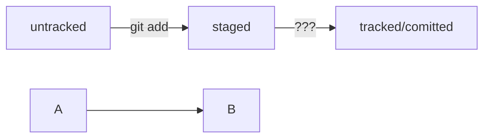

# Заголовок выделяется решеткой и пробелом 1 решетка большой заголовок

###### 6 решеток маленький заголовок

Курсив выделяется * или  _  *Курсив*

Жирный текст выделяется ** или  __

---

Для создания репозитория используем 

```bash

mkdir 'название'
git init
git add .
git commit -m 'Сообщение'
git remote add origin ssh-key
git push -u origin main
```
---



