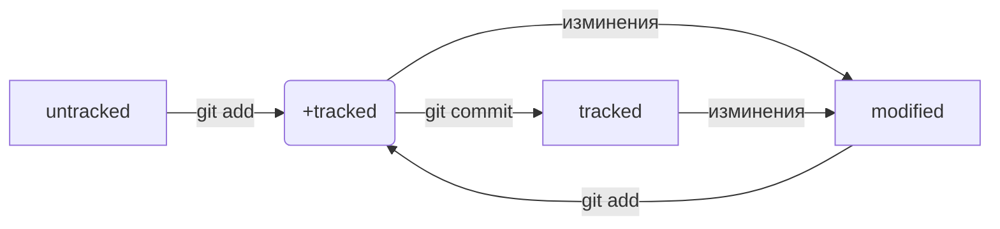

# Заголовок выделяется решеткой и пробелом 1 решетка большой заголовок

###### 6 решеток маленький заголовок

Курсив выделяется * или  _  *Курсив*

Жирный текст выделяется ** или  __

---

Для создания репозитория используем 

```bash

mkdir 'название'
git init
git add .
git commit -m 'Сообщение'
git remote add origin ssh-key
git push -u origin main
```
---

**Хеш - это информация о коммите**

Файл **HEAD** (англ. «голова», «головной») — один из служебных файлов папки .git. Он указывает на коммит, который сделан последним (то есть на самый новый).

**git status** показывает только следующие состояния файлов:
staged (Changes to be committed в выводе git status);
modified (Changes not staged for commit);
untracked (Untracked files);



